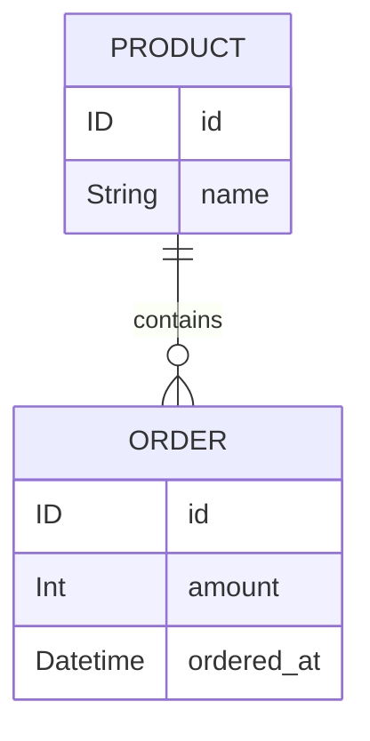

# Data Loader

## お題

### ER

例として、次のデータ構造に対するクエリを考えていきます。



### SDL

GraphQL SDL として、以下を実現するとします。

```graphql
type Product {
  id: ID!

  name: String!

  """
  該当商品の注文の一覧
  """
  orders: [OrderInterface!]!
}

interface OrderInterface {
  id: ID!
  amount: Int!
  orderedAt: String!
}

type Order implements OrderInterface {
  id: ID!
  amount: Int!
  orderedAt: String!

  """
  注文対象の商品
  """
  product: Product!
}

type Query {
  """
  商品単件
  """
  product(id: ID!): Product

  """
  商品一覧
  """
  allProducts: [Product!]!

  """
  注文単件
  """
  order(id: ID!): Order

  """
  注文一覧
  """
  allOrders: [Order!]!
}
```

### Models

商品(`Product`) と注文(`Order`) に対しては、それぞれ以下の Model Class によってデータ取得ができると想定します。別のマイクロサービスを想定してもいいですし、コメントに記載したような SQL を発行させる OR マッパーを想定しても構いません。

```ts
type ProductData = {
  readonly id: string
  readonly name: string
}

export class ProductModel {
  async fetchAll(): Promise<readonly ProductData[]> {
    // SELECT * FROM products LIMIT ?
  }

  async findBy(id: string): Promise<ProductData | null> {
    // SELECT * FROM products WHERE id = ?
  }
}
```

```ts
type OrderData = {
  readonly id: string
  readonly amount: number
  readonly productId: string
  readonly orderedAt: Date
}

export class OrderModel {
  async fetchAll(): Promise<readonly OrderData[]> {
    // SELECT * FROM orders LIMIT ?
  }

  async findBy(id: string): Promise<OrderData | null> {
    // SELECT * FROM orders WHERE id = ?
  }

  async findManyByProduct(...productIds: string[]): Promise<readonly OrderData[]> {
    // SELECT * FROM orders WHERE product_id IN (?, ?, ,,,)
  }
}
```

## Naive Resolvers

まずは DataLoader を用いないナイーブな Resolver 実装を見ていきます。

```ts
export type Context = {
  readonly productModel: ProductModel
  readonly orderModel: OrderModel
}

const OrderInterface = new GraphQLInterfaceType({
  name: "OrderInterface",
  fields: {
    id: {
      type: new GraphQLNonNull(GraphQLID),
    },
    amount: {
      type: new GraphQLNonNull(GraphQLInt),
    },
    orderedAt: {
      type: new GraphQLNonNull(GraphQLString),
    },
  },
})

const ProductType = new GraphQLObjectType({
  name: "Product",
  fields: {
    id: {
      type: new GraphQLNonNull(GraphQLID),
    },
    name: {
      type: new GraphQLNonNull(GraphQLString),
    },
    orders: {
      type: new GraphQLNonNull(new GraphQLList(new GraphQLNonNull(OrderInterface))),
      resolve: (source: ProductData, __, context: Context) => context.orderModel.findManyByProduct(source.id),
    },
  },
})

const OrderType = new GraphQLObjectType({
  name: "Order",
  interfaces: [OrderInterface],
  isTypeOf: () => true,
  fields: {
    id: {
      type: new GraphQLNonNull(GraphQLID),
    },
    product: {
      type: new GraphQLNonNull(ProductType),
      resolve: (source: OrderData, _, context: Context) => context.productModel.findBy(source.productId),
    },
    amount: {
      type: new GraphQLNonNull(GraphQLInt),
    },
    orderedAt: {
      type: new GraphQLNonNull(GraphQLString),
      resolve: (source: OrderData) => source.orderedAt.toISOString(),
    },
  },
})

const QueryType = new GraphQLObjectType({
  name: "Query",
  fields: {
    product: {
      args: {
        id: {
          type: new GraphQLNonNull(GraphQLID),
        },
      },
      type: ProductType,
      resolve: (_, args: { readonly id: string }, context: Context) => context.productModel.findBy(args.id),
    },
    allProducts: {
      type: new GraphQLNonNull(new GraphQLList(new GraphQLNonNull(ProductType))),
      resolve: (_, __, context: Context) => context.productModel.fetchAll(),
    },
    order: {
      args: {
        id: {
          type: new GraphQLNonNull(GraphQLID),
        },
      },
      type: OrderType,
      resolve: (_, args: { readonly id: string }, context: Context) => context.orderModel.findBy(args.id),
    },
    allOrders: {
      type: new GraphQLNonNull(new GraphQLList(new GraphQLNonNull(OrderType))),
      resolve: (_, __, context: Context) => context.orderModel.fetchAll(),
    },
  },
})

export const createSchema = () =>
  new GraphQLSchema({
    query: QueryType,
  })
```

これで準備が整いました。

Resolver の実行を考えるにあたって、次のサンプルデータを例にしてみます。6 件の商品と、5 件の注文データが存在しているような状況です。

```ts
const products = [
  { id: "001", name: "product 001" },
  { id: "002", name: "product 002" },
  { id: "003", name: "product 003" },
  { id: "004", name: "product 004" },
  { id: "005", name: "product 005" },
  { id: "006", name: "product 006" },
]

const orders = [
  { id: "order001", productId: "001", amount: 1_000, orderedAt: new Date("2022-11-01") },
  { id: "order002", productId: "002", amount: 2_000, orderedAt: new Date("2022-11-02") },
  { id: "order003", productId: "001", amount: 4_000, orderedAt: new Date("2022-11-03") },
  { id: "order004", productId: "003", amount: 3_000, orderedAt: new Date("2022-11-04") },
  { id: "order005", productId: "003", amount: 5_000, orderedAt: new Date("2022-11-05") },
]
```

### Field Resolver の動作原則(おさらい)

まずは小手調べから。以下の「注文単件取得」クエリを `id: "order001"` に対して実行した場合、Field Resolver は何回動作するでしょうか？

```graphql
query OrderQuery($id: ID!) {
  order(id: $id) {
    id
    amount
    product {
      id
      name
    }
  }
}
```

正解は 6 回です。

- `order` そのもの
- `order.id`, `order.amount`, `order.product`
- `order.product.id`, `order.product.name`

これらのうち、 Context の Model class は `context.orderModel.findBy` と `context.productModel.findBy` の都合 2 回が動作することになります。
RDB バックエンドであれば、2 本の SQL が発行されるイメージです。

### テストコード

以下のテストコードで実際に確認することができます。

```ts
import { execute, parse, DocumentNode } from "graphql"

import { createSchema, ProductModel, OrderModel } from "./schema"

describe("schema", () => {
  describe("execution", () => {
    let document: DocumentNode
    let variableValues: Record<string, any> = {}
    const productModel = new ProductModel()
    const orderModel = new OrderModel()

    const subject = async () =>
      await execute({ schema: createSchema(), contextValue: { productModel, orderModel }, document, variableValues })

    const productFindBy = jest.spyOn(productModel, "findBy")
    const productFetchAll = jest.spyOn(productModel, "fetchAll")
    const orderFindBy = jest.spyOn(orderModel, "findBy")
    const orderFetchAll = jest.spyOn(orderModel, "fetchAll")
    const orderfindManyByProduct = jest.spyOn(orderModel, "findManyByProduct")
    const mocks = [productFindBy, productFetchAll, orderFindBy, orderFetchAll, orderfindManyByProduct]

    beforeEach(() => {
      variableValues = {}
      mocks.forEach(mock => mock.mockClear())
    })

    describe("when product to look up exists", () => {
      beforeEach(() => {
        const products = [
          { id: "001", name: "product 001" },
          { id: "002", name: "product 002" },
          { id: "003", name: "product 003" },
          { id: "004", name: "product 004" },
          { id: "005", name: "product 005" },
          { id: "006", name: "product 006" },
        ]
        const orders = [
          { id: "order001", productId: "001", amount: 1_000, orderedAt: new Date("2022-11-01") },
          { id: "order002", productId: "002", amount: 2_000, orderedAt: new Date("2022-11-02") },
          { id: "order003", productId: "001", amount: 4_000, orderedAt: new Date("2022-11-03") },
          { id: "order004", productId: "003", amount: 3_000, orderedAt: new Date("2022-11-04") },
          { id: "order005", productId: "003", amount: 5_000, orderedAt: new Date("2022-11-05") },
        ]
        productFindBy.mockImplementation(id => Promise.resolve(products.find(data => data.id === id) ?? null))
        productFetchAll.mockImplementation(() => Promise.resolve(products))
        orderFindBy.mockImplementation(id => Promise.resolve(orders.find(data => data.id === id) ?? null))
        orderFetchAll.mockImplementation(() => Promise.resolve(orders))
        orderfindManyByProduct.mockImplementation((...ids) =>
          Promise.resolve(orders.filter(order => ids.includes(order.productId))),
        )
      })

      test("nested object", async () => {
        document = gql`
          query OrderQuery($id: ID!) {
            order(id: $id) {
              id
              amount
              product {
                id
                name
              }
            }
          }
        `
        variableValues = { id: "order001" }
        await expect(subject()).resolves.toMatchObject({
          data: {
            order: { product: { id: "001", name: "product 001" } },
          },
        })
        expect(productFindBy).toBeCalledTimes(1)
        expect(orderFindBy).toBeCalledTimes(1)
      })
    })
  })
})

function gql(arr: TemplateStringsArray) {
  return parse(arr[0])
}
```

## 1 + N Problem

次にクエリを少し変更してみます。先程は注文一件を取得するクエリでしたが、注文の一覧を取得するように変更してみます。

```graphql
query OrdersQuery {
  allOrders {
    id
    amount
    product {
      id
      name
    }
  }
}
```

実装という意味では、トップレベルの Query で動作する Field Resolver が `order` から `allOrders` に変わるだけです。

```ts
const QueryType = new GraphQLObjectType({
  name: "Query",
  fields: {
    order: {
      args: {
        id: {
          type: new GraphQLNonNull(GraphQLID),
        },
      },
      type: OrderType,
      resolve: (_, args: { readonly id: string }, context: Context) => context.orderModel.findBy(args.id),
    },
    allOrders: {
      type: new GraphQLNonNull(new GraphQLList(new GraphQLNonNull(OrderType))),
      resolve: (_, __, context: Context) => context.orderModel.fetchAll(),
    },
  },
})
```

しかし Field Resolver が動作する回数という意味では大きく異なります。

今用意しているテストデータに即すと注文は 5 件ありますので、`allOrders` の Field Resolver は 5 個の 要素を持つ配列を返却します。

配列内の要素一つにつき、`id`, `amount`, `pruduct`, `product.id`, `product.name` に相当する Field Resolver が動作するため、都合 `1 + 5 * 5`, すなわち 26 回実行されることになります。

特に `OrderType` における `product` Field Resolver は `ProductModel` の呼び出しを行います。

```ts
const OrderType = new GraphQLObjectType({
  name: "Order",
  interfaces: [OrderInterface],
  isTypeOf: () => true,
  fields: {
    product: {
      type: new GraphQLNonNull(ProductType),
      resolve: (source: OrderData, _, context: Context) => context.productModel.findBy(source.productId),
    },
    orderedAt: {
      type: new GraphQLNonNull(GraphQLString),
      resolve: (source: OrderData) => source.orderedAt.toISOString(),
    },
  },
})
```

SQL で考えた場合、N=5 件の注文一覧であるのでれば、以下のようになるでしょう。

```sql
SELECT * FROM orders LIMIT ?;

SELECT * FROM products WHERE id = ?;
SELECT * FROM products WHERE id = ?;
SELECT * FROM products WHERE id = ?;
SELECT * FROM products WHERE id = ?;
SELECT * FROM products WHERE id = ?;
```

今回用意した Schema では 商品の一覧からそれぞれの商品ごとの注文リストをたどることもできるようにしていますが、Resolver の呼び出し回数が発散するという意味では同様です。

```graphql
query ProductsOrdersQuery {
  allProducts {
    id
    name
    orders {
      id
      amount
      orderedAt
    }
  }
}
```

```sql
SELECT * FROM products LIMIT ?;

SELECT * FROM orders WHERE product_id IN (?);
SELECT * FROM orders WHERE product_id IN (?);
SELECT * FROM orders WHERE product_id IN (?);
SELECT * FROM orders WHERE product_id IN (?);
SELECT * FROM orders WHERE product_id IN (?);
SELECT * FROM orders WHERE product_id IN (?);
```

このように **GraphQL Reolver の世界ではいとも簡単に N + 1 問題が発生** してしまうのです。

## DataLoader の導入

GraphQL Schema は Field Resolver が再帰的に何度も呼び出される都合上、リスト (`GraphQLList`) が絡むと容易に N + 1 が発生して性能劣化してしまいます。

この問題を汎用的に解決するために用いられるアプローチが Data Loader Pattern です。

[DataLoader](https://github.com/graphql/dataloader) は Facebook が GraphQL と併用するために開発したライブラリ名でもあります。

Data Loader は至ってシンプルで、根幹には 2 つの機能しかありません。Batching と Caching です。

### Batching

Batching とは「複数の処理をまとめて一括で実行すること」です。

先程のクエリを例に見ていきます。

```graphql
query ProductsOrdersQuery {
  allProducts {
    id
    name
    orders {
      id
      amount
      orderedAt
    }
  }
}
```

このクエリは、商品一覧を検索した後に、商品一つずつに対してさらに注文リストの SQL を発行するような処理になっていましたが、IN 句に必要な商品 ID を列挙してまとめることができるはずです。

```sql
-- BEFORE
SELECT * FROM products LIMIT ?;

SELECT * FROM orders WHERE product_id IN (?);
SELECT * FROM orders WHERE product_id IN (?);
SELECT * FROM orders WHERE product_id IN (?);
SELECT * FROM orders WHERE product_id IN (?);
SELECT * FROM orders WHERE product_id IN (?);
SELECT * FROM orders WHERE product_id IN (?);

-- AFTER
SELECT * FROM products LIMIT ?;

SELECT * FROM orders WHERE product_id IN (?, ?, ?, ?, ?, ?);
```

このようにできれば、1 + N 本の SQL が 1 + 1 本で済むことになります。

サンプルデータにおける Batching の要件を考えてみると「6 個の商品 id を受け取って、6 個分の注文リストを返却する」となっています。

もう少し汎用的な言葉で書くと「複数の key を受け取り、同じ個数の値のリストを返却する」が Batching の本質です。

上記の例であれば、次の `productOrdersLoader` を DataLoader で定義します。

```ts
const loaders = {
  productOrdersLoader: new DataLoader<string, OrderData[]>(async ids => {
    const orders = await orderModel.findManyByProduct(...ids)
    return ids.map(id => orders.filter(order => order.productId === id))
  }),
}
```

定義した loader は `ProductType` の `orders` Field Resolver で利用するようにすれば完了です。

```ts
const ProductType = new GraphQLObjectType({
  name: "Product",
  fields: {
    orders: {
      type: new GraphQLNonNull(new GraphQLList(new GraphQLNonNull(OrderInterface))),
      // resolve: (source: ProductData, __, context: Context) => context.orderModel.findManyByProduct(source.id),
      resolve: (source: ProductData, __, context: Context) => context.loaders.productOrdersLoader.load(source.id),
    },
  },
})
```

なお、個別の DataLoader インスタンスのライフサイクルは GraphQL Execution Context のライフサイクルと揃えておくのがベストプラクティスとされています。

以下のテストコードで `findManyByProduct` の呼び出し回数が 6 回から 1 回に削減されることが確認できます。

```ts
test("list in list", async () => {
  document = gql`
    query ProductsOrdersQuery {
      allProducts {
        id
        name
        orders {
          id
          amount
          orderedAt
        }
      }
    }
  `
  variableValues = {}
  await expect(subject()).resolves.toMatchObject({
    data: {
      allProducts: [{}, {}, {}, {}, {}, {}],
    },
  })
  expect(productFetchAll).toBeCalledTimes(1)
  expect(orderfindManyByProduct).not.toBeCalledTimes(6)
  expect(orderfindManyByProduct).toBeCalledTimes(1)
})
```

### Caching

もう一つの Data Loader の重要機能が Caching です。
Data Loader が一度インスタンスに読み込んだ key に対応する値は、キャッシュされて再利用可能になります。

Data Loader がよしなにやってくれる箇所なので、基本的に強く意識する必要はありません。

確認として以下のクエリで Caching を有効活用してみましょう。

```graphql
query OrdersQuery {
  allOrders {
    id
    amount
    product {
      id
      name
    }
  }
}
```

`ProductModel#findBy` メソッドをラップしただけの Loader を用意して Resolver で利用するようにリファクタします。

```ts
const loaders = {
  productLoader: new DataLoader<string, ProductData>(ids =>
    Promise.all(ids.map(id => productModel.findBy(id).then(data => data ?? new Error()))),
  ),
}
```

```ts
const OrderType = new GraphQLObjectType({
  fields: {
    product: {
      type: new GraphQLNonNull(ProductType),
      // resolve: (source: OrderData, _, context: Context) => context.productModel.findBy(source.productId),
      resolve: (source: OrderData, _, context: Context) => context.loaders.productLoader.load(source.productId),
    },
  },
})
```

SQL バックエンドであれば IN 句を使うよう変更した方が効率的なのですが、`ProductModel#findBy` がサードパーティ API 呼び出しとなっていてリスト取得処理が提供されないようなケースであったとしても、同一 key に対する非同期呼び出しの回数を削減できる分、パフォーマンスの向上に繋がります。

また、同一の GraphQL オペレーション中では、key に対する値の一貫性が保たれるという利点もあります。
